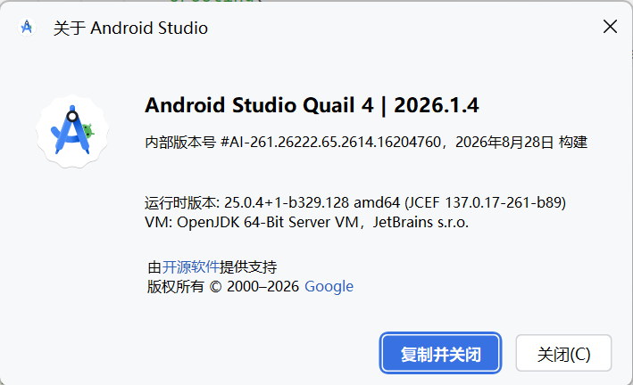
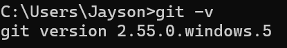
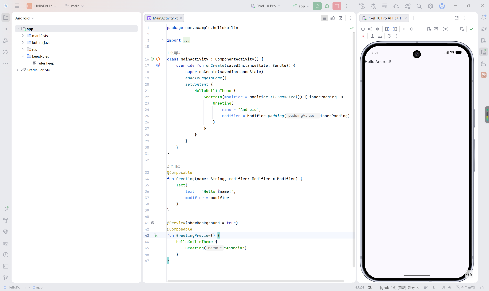

## 实验1 Android开发基础

1. 通过 `JetBrains Toolbox` 下载最新版的 `Android Studio` ，如下图所示：

   

2. 本机已有 `Git` 版本如图：

   

3. 通过 `Android Studio` 构建新的项目，运行结果如图：

   

   成功在模拟器上面打印出 Hello Android！

4. 注册Github账号，在 `Android Studio` 的 设置→版本控制→Github 登录Github账号，然后添加远端URL，本地 拉取→提交→推送，即可在Github仓库中看见新建的 `HelloKotlin` 仓库了。

5. 受网络环境限制，进行Github提交和拉取的时候还使用到了工具 [FastGithub](https://github.com/creazyboyone/FastGithub)。